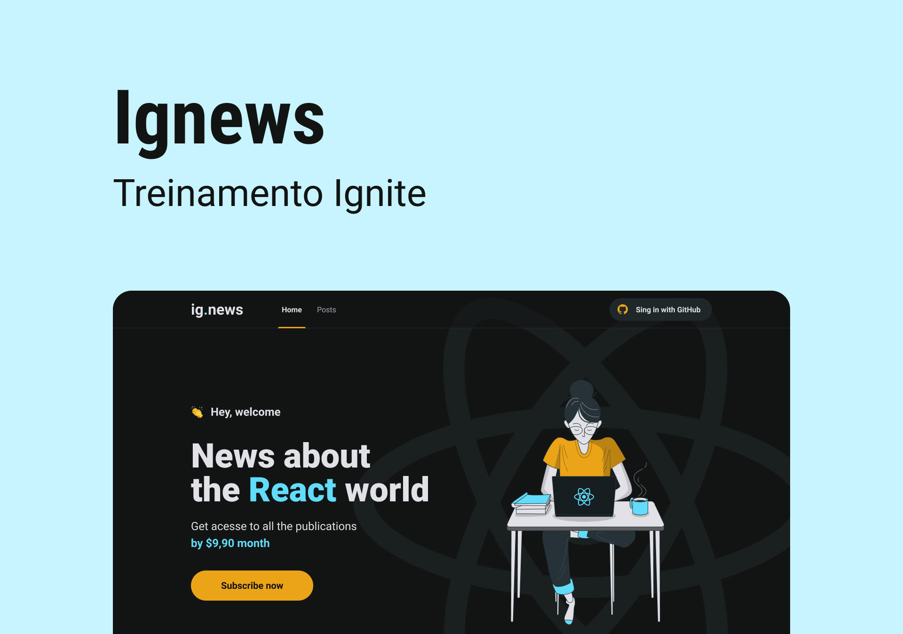
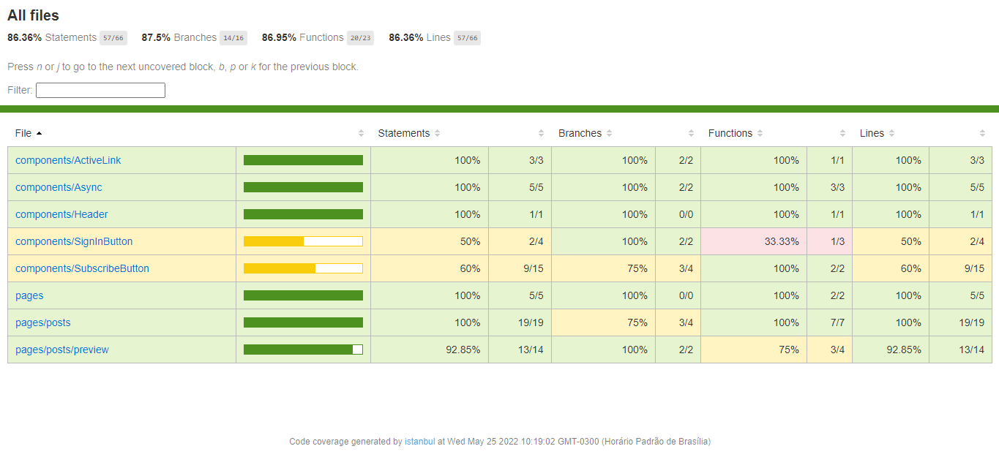

<section align="center">
    
</section>

<h2 align="center">Summary</h2>

<p align="center">
    <a href="#about">📙 About</a>
    <a href="#preview">🖼️ Preview</a>
    <a href="#start">📖 How to Start</a>
    <a href="#features">💡 Features</a>
    <a href="#technologies">💻 Technologies</a>
</p>

<h4 align="center">
   ✔️ Ig.news project finished ✔️
</h4>

<H2 id="about">📙 About</H2>

<p>Ig.news is a serverless website based on Next.js framework usage and has an authentication functionality that allows the user to get access to written content about the ReactJS world if he is logged in or a preview of the original content if he's not.</p>
<p>The access is allowed trough a payed monthly subscription and the authentication uses Github to get the user's basic information.</p>
<p>In conclusion, this application was used to implement and learn unit testing basic concepts and tips on how to set <a href="https://vercel.com/">Vercel</a> config and environment variables settings.</p>
<p>This project is originally created on Ignite from <a href="https://www.rocketseat.com.br/">Rocketseat</a>
 and made by <a href="https://www.linkedin.com/in/kleverson-kenji-iwatani/">Kenji Iwatani</a></p>

<p>
    <h3><a href="https://ignews-kenji.vercel.app/">Check website &rarr;</a></h3>
</p>


---

<H2 id="preview">🖼️ Preview</H2>

<h4>Project overview:</h4>

<section align="center">
    
</section>

<h4>Tests coverage report:</h4>

<section align="center">
    
</section>

---

<H2 id="start">📖 How to Start</H2>

<h3>Starting this repository:</h3>

```bash
# Clone this repository
$ git clone https://github.com/iwataniKenji/ignews

# Access the project directory
$ cd ignews
```

<h3>Creating and setting the project:</h3>
<p>It's required an account on <a href="https://stripe.com/">Stripe</a> (for payment system), <a href="https://fauna.com/">Fauna</a> (for database functionality), and <a href="https://prismic.io/">Prismic</a> (to create publications of the website).</p>

```bash
# Install dependencies
$ yarn

# On ".env.example" file, fill the environment variables according to the instructions provided
$

# Rename the config file
$ ren ".env.example" ".env.local"

# Execute stripe to listen the events from webhooks
$ stripe listen --forward-to localhost:3000/api/webhooks

# Initialize and open local host
$ yarn dev
```

<h3>Running tests:</h3>

```bash
# Run tests
$ yarn test
```

---

<H2 id="features">💡 Features</H2>

- [x] Static website with SSG
- [x] Github authentication
- [x] Subscription and payment system using Stripe
- [x] Redirect when not authenticated
- [x] Validation of active subscriptions
- [x] Prevents duplicated customers accounts
- [x] Posts preview functionality for non-subscribed users
- [x] Backend independent (serverless website)
- [x] Unit tests implemented and covering most of the application

---

<H2 id="technologies">💻 Technologies</H2>

- [x] <a href="https://nextjs.org/">Next.js</a>
- [x] <a href="https://reactjs.org/">React</a>
- [x] <a href="https://www.typescriptlang.org/">Typescript</a>
- [x] <a href="https://sass-lang.com/">SASS</a>
- [x] <a href="https://github.com/css-modules/css-modules">CSS Modules</a>
- [x] <a href="https://prismic.io/">Prismic CMS</a>
- [x] <a href="https://stripe.com/">Stripe</a>
- [x] <a href="https://fauna.com/">FaunaDB</a>
- [x] <a href="https://jamstack.org/">JAMStack</a>
- [x] <a href="https://jestjs.io/">Jest</a>
- [x] <a href="https://vercel.com/">Vercel</a>
