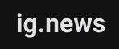

<section align="center">
    
</section>

---

<h2 align="center">Summary</h2>

    <a href="#about">📙 About</a>
    <!-- <a href="#preview">🖼️ Preview</a> -->
    <a href="#features">💡 Features</a>
    <a href="#technologies">💻 Technologies</a>

<h4 align="center">
   ✔️ Ig.news project finished ✔️
</h4>

<H2 id="about">📙 About</H2>

Ig.news is a website based on Next.js framework usage and has an authentication functionality that allows the user to get access to written content about the ReactJS world if he is logged in or a preview of the original content if he's not.

The access is allowed though a payed monthly subscription and the authentication uses Github to get the user's basic information.

This project is originally created on Ignite from <a href="https://www.rocketseat.com.br/">Rocketseat</a> and made by <a href="https://www.linkedin.com/in/kleverson-kenji-iwatani/">Kenji Iwatani</a>

<!-- ---

<H2 id="preview">🖼️ Preview</H2>

<section align="center">
    
</section> -->

---

<H2 id="features">💡 Features</H2>

- [X] Static website with SSG
- [x] Github authentication
- [x] Subscription and payment system using Stripe
- [x] Redirect when not authenticated
- [x] Validation of active subscriptions
- [x] Prevents duplicated customers accounts
- [x] Posts preview functionality for non-subscribed users
- [x] Backend independent

---

<H2 id="technologies">💻 Technologies</H2>

- [x] <a href="https://nextjs.org/">Next.js</a>
- [x] <a href="https://reactjs.org/">React</a>
- [x] <a href="https://www.typescriptlang.org/">Typescript</a>
- [x] <a href="https://sass-lang.com/">SASS</a>
- [x] <a href="https://github.com/css-modules/css-modules">CSS Modules</a>
- [x] <a href="https://prismic.io/">Prismic CMS</a>
- [x] <a href="https://stripe.com/">Stripe</a>
- [x] <a href="https://fauna.com/">FaunaDB</a>
- [x] <a href="https://jamstack.org/">JAMStack</a>
